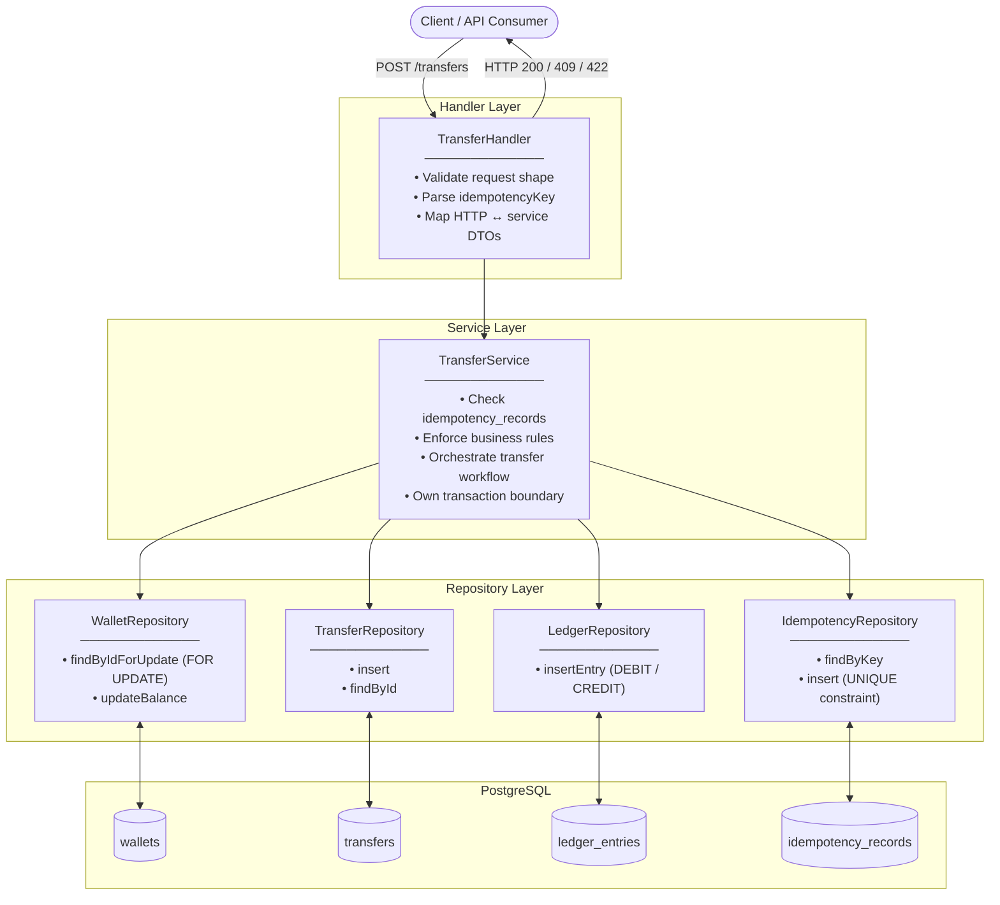
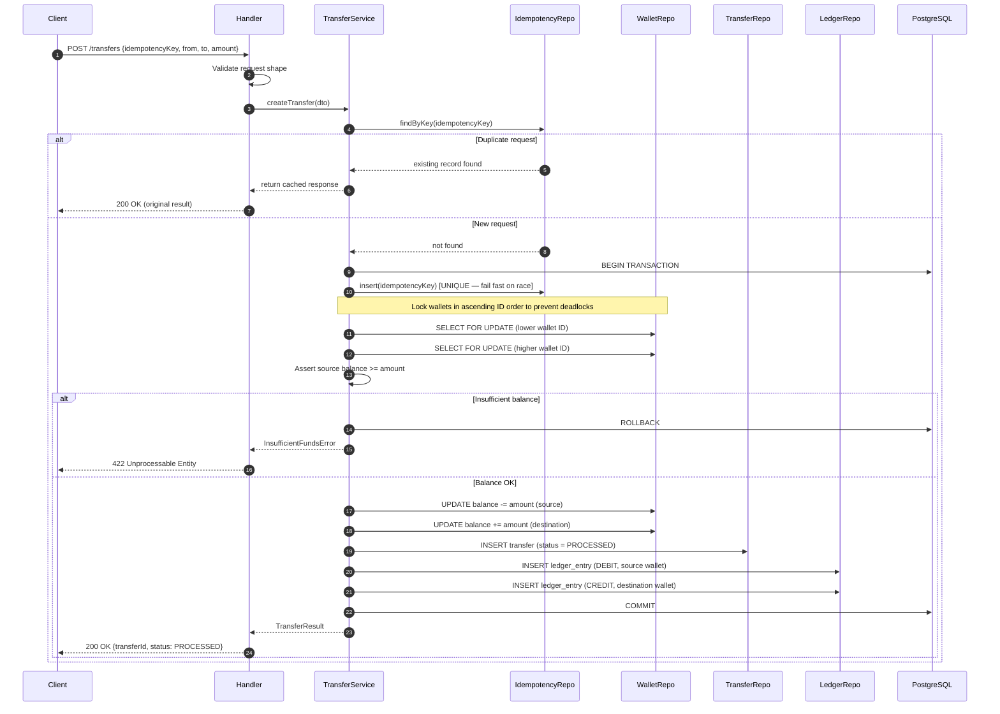
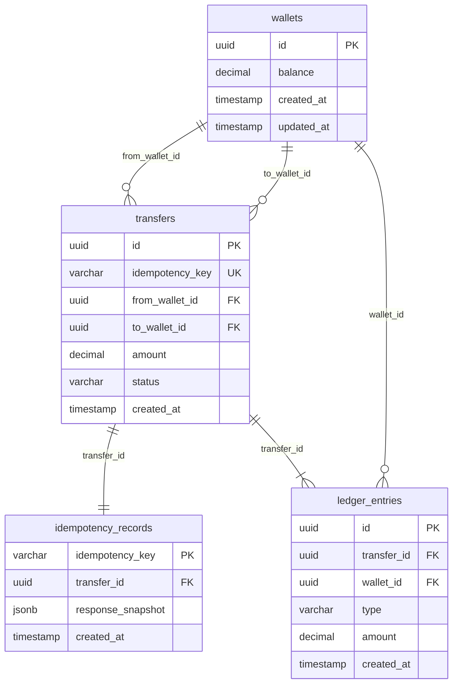

# Wallet Transfer Service — Solution Design

## Overview

This document describes the chosen architecture for the wallet transfer service — **Pessimistic Locking with a Dedicated Idempotency Table** — covering system design, data model, request flow, and the rationale behind key decisions.

---

## High-Level Architecture — Approach 1 (Recommended)

### System Layers



---

### Transfer Request Flow



---

### Database Schema



---

### Atomic Transaction Boundary


---

## Design Decisions

### Why Pessimistic Locking

For a wallet transfer service evaluated on **correctness, transactional safety, and idempotency**, Approach 1 is the strongest choice:

1. **Correctness is easy to verify.** Row-level locking makes the execution path deterministic and serial for any pair of wallets. There are no retry loops or conflict windows to reason about.

2. **Idempotency is airtight.** The combination of an application-level check and a `UNIQUE` DB constraint on `idempotency_key` handles all race conditions — including two concurrent identical requests hitting the server simultaneously.

3. **Matches the evaluation criteria directly.** The assignment explicitly asks you to choose and justify a lock strategy. Pessimistic locking is the clearest answer to "safe under concurrent debits on the same wallet."

4. **Deadlock prevention is mechanical.** Always acquire wallet locks in ascending ID order — this is a one-liner in the repository layer and completely prevents deadlocks.

5. **Scope-appropriate.** Optimistic locking adds retry complexity that is hard to test correctly. Event sourcing adds query complexity with no benefit at this scale.

### Lock Ordering Rule (Critical)

```text
Always lock wallets in ascending wallet_id order.

Lock(min(from_wallet_id, to_wallet_id)) first
Lock(max(from_wallet_id, to_wallet_id)) second
```

This single rule eliminates all deadlock scenarios regardless of concurrent request ordering.

### Transaction Boundary (Single Atomic Unit)

```text
BEGIN TRANSACTION
  1. INSERT idempotency_records (idempotency_key) — fail fast if duplicate
  2. SELECT ... FOR UPDATE on source wallet
  3. SELECT ... FOR UPDATE on destination wallet
  4. Validate source wallet balance >= amount
  5. UPDATE wallets SET balance = balance - amount WHERE id = source
  6. UPDATE wallets SET balance = balance + amount WHERE id = destination
  7. INSERT transfers (status = PROCESSED)
  8. INSERT ledger_entries (DEBIT for source)
  9. INSERT ledger_entries (CREDIT for destination)
COMMIT
```

If any step fails, the entire transaction rolls back — no partial state, no orphaned ledger entries, no inconsistent balances.

---

## Tech Stack Suggestion

| Component | Choice | Reason |
|---|---|---|
| Language | Node.js (TypeScript) or Go | Clean layering is natural in both |
| Database | PostgreSQL | Native `FOR UPDATE`, strong transaction support |
| ORM/Query | Knex.js / `pgx` (Go) / Prisma | Explicit transaction control without magic |
| Testing | Jest / Go test | Behavioral tests against a real DB (not mocks) |

> **Note on testing:** Use a real PostgreSQL instance (or SQLite for simplicity) in tests — not mocked repositories. Idempotency and concurrency correctness cannot be meaningfully tested against mocks.
