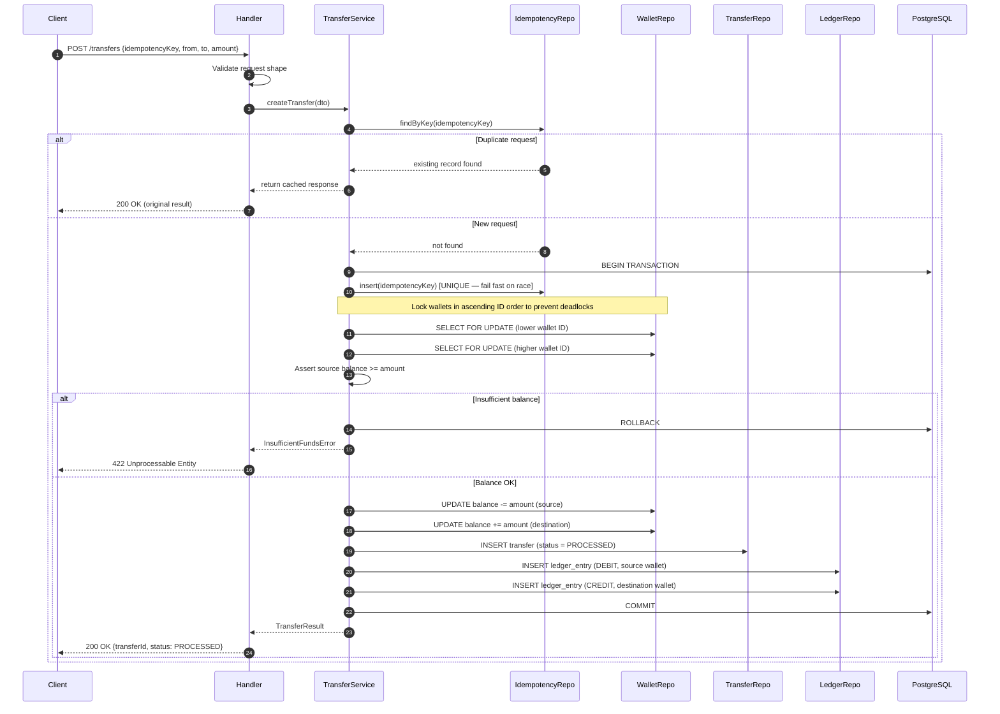
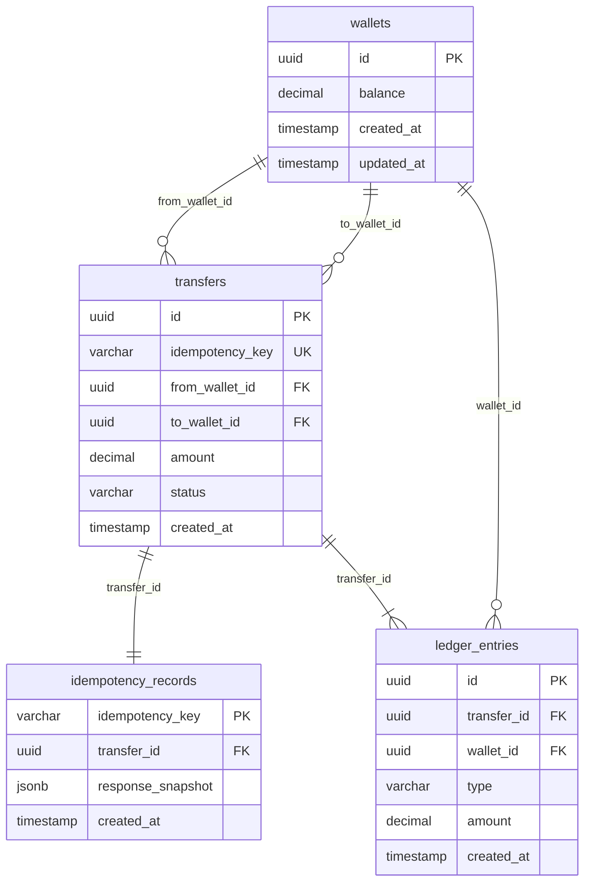
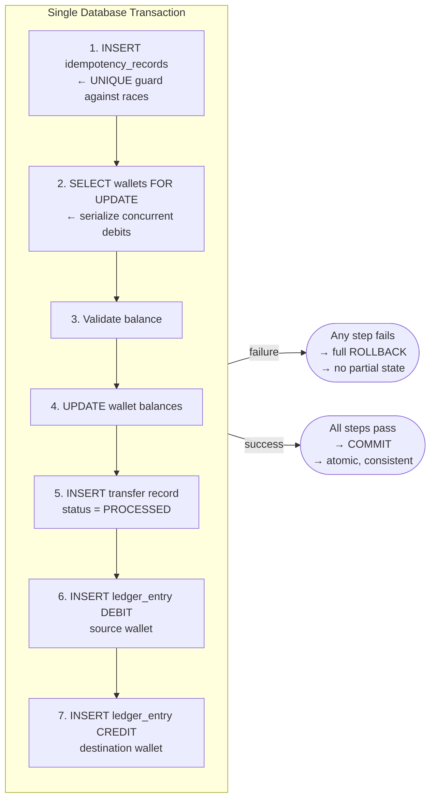

# Wallet Transfer Service — Solution Design

## Overview

This document outlines three candidate approaches for implementing the wallet transfer service, with a pros/cons analysis and a final recommendation.

---

## High-Level Architecture — Approach 1 (Recommended)

### System Layers


---

### Transfer Request Flow



---

### Database Schema



---

### Atomic Transaction Boundary



---

## Approach 1: Pessimistic Locking + Dedicated Idempotency Table

### How It Works

- Use `SELECT ... FOR UPDATE` on the wallet row before reading and updating balances.
- Store every incoming `idempotencyKey` in a dedicated `idempotency_records` table with a `UNIQUE` constraint on the key.
- On each transfer request:
  1. Check `idempotency_records` for an existing key — if found, return the stored response immediately.
  2. Begin a transaction, acquire row-level locks on both wallets (in a consistent order to avoid deadlocks).
  3. Validate balance, update wallets, insert the transfer record, insert two ledger entries, insert the idempotency record.
  4. Commit atomically.

### Schema

```sql
wallets           (id, balance, created_at, updated_at)
transfers         (id, idempotency_key UNIQUE, from_wallet_id, to_wallet_id, amount, status, created_at)
ledger_entries    (id, transfer_id, wallet_id, type, amount, created_at)
idempotency_records (idempotency_key PK, transfer_id, response_snapshot, created_at)
```

### Pros

- Simple to reason about — locks make the execution serial for any given wallet.
- No retry loops needed in application code.
- Idempotency is enforced at two levels: the `UNIQUE` constraint on `idempotency_key` in `transfers` and the dedicated `idempotency_records` table.
- Correct under concurrent duplicate requests — the DB constraint catches the race even if two threads pass the application-level check simultaneously.
- Well-understood pattern in PostgreSQL; battle-tested.

### Cons

- Row-level locks increase contention on hot wallets (high-throughput wallets block each other).
- Lock ordering (always lock lower wallet ID first) must be implemented carefully to avoid deadlocks.
- Slightly higher latency due to locking overhead.
- Not suitable as-is for distributed databases where `FOR UPDATE` semantics differ.

---

## Approach 2: Optimistic Locking with Version-Based CAS

### How It Works

- Add a `version` column to the `wallets` table.
- No explicit locks are acquired. Instead, the update includes a `WHERE version = :expected_version` predicate.
- If another transaction updated the row first, the update affects 0 rows → retry the transfer (up to N times).
- Idempotency is still enforced via a `UNIQUE` constraint on `idempotency_key` — no separate idempotency table.

### Schema

```sql
wallets           (id, balance, version, created_at, updated_at)
transfers         (id, idempotency_key UNIQUE, from_wallet_id, to_wallet_id, amount, status, created_at)
ledger_entries    (id, transfer_id, wallet_id, type, amount, created_at)
```

### Transfer Update Logic

```sql
UPDATE wallets
SET balance = balance - :amount, version = version + 1
WHERE id = :wallet_id AND version = :expected_version;
-- If rows_affected == 0 → conflict detected → retry
```

### Pros

- No locks held during reads — higher throughput under low-to-medium contention.
- Simpler schema (no idempotency table needed if relying on the `UNIQUE` constraint on `idempotency_key`).
- Works well when conflicts are rare (most wallets are not hot).

### Cons

- Retry logic adds application complexity and must be carefully bounded (max retries, backoff).
- Under high contention (same hot wallet), retries cascade — performance degrades worse than pessimistic locking.
- Partial execution risk: if the debit succeeds on the first attempt but the credit fails, rollback and retry logic becomes complex.
- The `idempotencyKey` `UNIQUE` constraint alone does not prevent a race where two concurrent identical requests both pass the "not found" check before either inserts — requires an insert-first-then-execute pattern or explicit advisory locks for airtight idempotency.
- Harder to reason about correctness under concurrent retries.

---

## Approach 3: Ledger-as-Source-of-Truth (Event Sourcing Style)

### How It Works

- **No stored balance column** on the wallet. Balance is always derived by summing ledger entries.
- Every transfer appends two immutable ledger entries (DEBIT + CREDIT).
- A transfer is valid if the computed balance of the source wallet at the time of insertion is >= the transfer amount.
- The uniqueness check on `idempotency_key` in the `transfers` table prevents duplicate processing.
- Use a serializable transaction isolation level or advisory locks to prevent concurrent over-spend on the same wallet.

### Schema

```sql
wallets           (id, owner_id, created_at)
transfers         (id, idempotency_key UNIQUE, from_wallet_id, to_wallet_id, amount, status, created_at)
ledger_entries    (id, transfer_id, wallet_id, type, amount, created_at)
-- Balance query: SELECT SUM(CASE WHEN type='CREDIT' THEN amount ELSE -amount END) FROM ledger_entries WHERE wallet_id = :id
```

### Pros

- Append-only — no updates to existing rows, making it highly auditable and naturally idempotent.
- Full audit trail by design — the ledger is the single source of truth.
- No inconsistency between a stored balance and the ledger.
- Scales well for read-heavy audit/history queries.

### Cons

- **Balance reads are expensive** — require a full aggregation over ledger entries per wallet unless a materialized view or balance snapshot is maintained.
- Concurrency safety is harder: serializable isolation or advisory locks are needed to prevent two transactions from both reading the same "valid" balance and both proceeding to debit.
- `SERIALIZABLE` isolation has its own performance costs and can cause transaction rollbacks under high concurrency.
- More complex to implement correctly than a straightforward balance column + row lock.
- Overkill for an assignment of this scope without infrastructure to support snapshots or materialized views.

---

## Comparison Summary

| Criteria | Approach 1 (Pessimistic) | Approach 2 (Optimistic) | Approach 3 (Event Sourcing) |
|---|---|---|---|
| Concurrency correctness | High — locks serialize access | Medium — retry logic required | Medium/Hard — needs SERIALIZABLE or advisory locks |
| Idempotency safety | Strong — two-level enforcement | Moderate — constraint only | Moderate — constraint only |
| Implementation complexity | Low | Medium | High |
| Performance under low contention | Good | Best | Good (expensive reads) |
| Performance under high contention | Degrades (blocking) | Degrades (retries) | Degrades (serializable aborts) |
| Auditability | Good (ledger entries) | Good (ledger entries) | Best (ledger is truth) |
| Schema simplicity | Simple | Simplest | Most complex query patterns |
| Suitability for this assignment | Best fit | Viable | Overengineered |

---

## Recommendation: Approach 1 — Pessimistic Locking + Dedicated Idempotency Table

### Rationale

For a wallet transfer service evaluated on **correctness, transactional safety, and idempotency**, Approach 1 is the strongest choice:

1. **Correctness is easy to verify.** Row-level locking makes the execution path deterministic and serial for any pair of wallets. There are no retry loops or conflict windows to reason about.

2. **Idempotency is airtight.** The combination of an application-level check and a `UNIQUE` DB constraint on `idempotency_key` handles all race conditions — including two concurrent identical requests hitting the server simultaneously.

3. **Matches the evaluation criteria directly.** The assignment explicitly asks you to choose and justify a lock strategy. Pessimistic locking is the clearest answer to "safe under concurrent debits on the same wallet."

4. **Deadlock prevention is mechanical.** Always acquire wallet locks in ascending ID order — this is a one-liner in the repository layer and completely prevents deadlocks.

5. **Scope-appropriate.** Optimistic locking adds retry complexity that is hard to test correctly. Event sourcing adds query complexity with no benefit at this scale.

### Lock Ordering Rule (Critical)

```text
Always lock wallets in ascending wallet_id order.

Lock(min(from_wallet_id, to_wallet_id)) first
Lock(max(from_wallet_id, to_wallet_id)) second
```

This single rule eliminates all deadlock scenarios regardless of concurrent request ordering.

### Transaction Boundary (Single Atomic Unit)

```text
BEGIN TRANSACTION
  1. INSERT idempotency_records (idempotency_key) — fail fast if duplicate
  2. SELECT ... FOR UPDATE on source wallet
  3. SELECT ... FOR UPDATE on destination wallet
  4. Validate source wallet balance >= amount
  5. UPDATE wallets SET balance = balance - amount WHERE id = source
  6. UPDATE wallets SET balance = balance + amount WHERE id = destination
  7. INSERT transfers (status = PROCESSED)
  8. INSERT ledger_entries (DEBIT for source)
  9. INSERT ledger_entries (CREDIT for destination)
COMMIT
```

If any step fails, the entire transaction rolls back — no partial state, no orphaned ledger entries, no inconsistent balances.

---

## Tech Stack Suggestion

| Component | Choice | Reason |
|---|---|---|
| Language | Node.js (TypeScript) or Go | Clean layering is natural in both |
| Database | PostgreSQL | Native `FOR UPDATE`, strong transaction support |
| ORM/Query | Knex.js / `pgx` (Go) / Prisma | Explicit transaction control without magic |
| Testing | Jest / Go test | Behavioral tests against a real DB (not mocks) |

> **Note on testing:** Use a real PostgreSQL instance (or SQLite for simplicity) in tests — not mocked repositories. Idempotency and concurrency correctness cannot be meaningfully tested against mocks.
